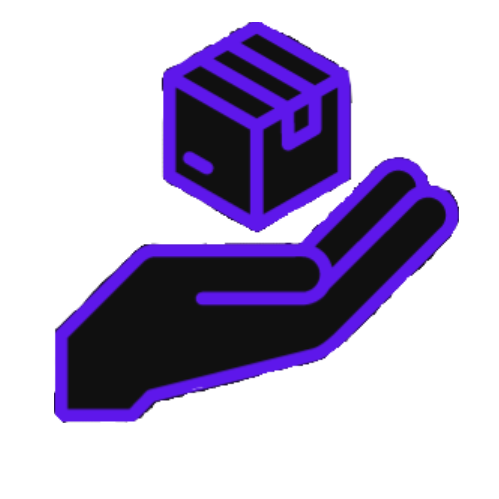

#### Exercicio prático, com intuito de acessar o conteúdo [guia](https://jsonplaceholder.typicode.com/guide) e listar uma página com endpoint: [API](https://jsonplaceholder.typicode.com/posts)
- Foi utilizado o **Angular** framework no projeto ao lado do **Docker**.
- Foram realizadas 3 rotas de acesso do usuário:
  - Página Inicial
    - Exemplifica toda a lista de posts com possibilidade de busca pelo ID.
  - Dashboard Post
    - Dispõe de uma visualização individual do post desejado.
  - Carta de Apresentação
    - Minha apresentação, experências, anseios e competências.
- Por fim, agradeço a paciência para a realização do projeto.

<h3 align="center"> 👾 Colaborador: <a href="https://github.com/joapedu"><strong>@joapedu</strong></a>  João Eduardo - 20220035851</h3>
<h4 align="center">:phone: <i>C O N T A T O S</i> :phone:</h4>

    
    
    

